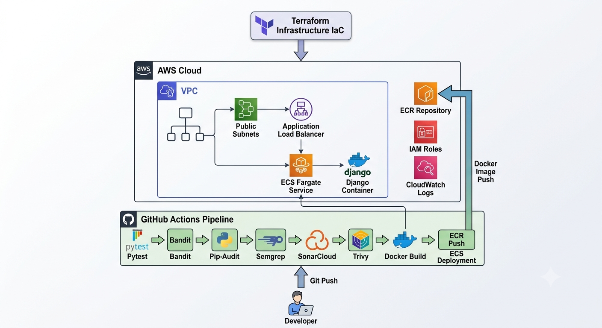
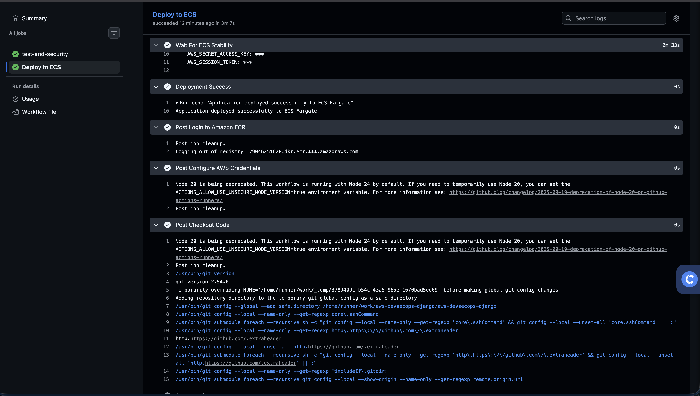
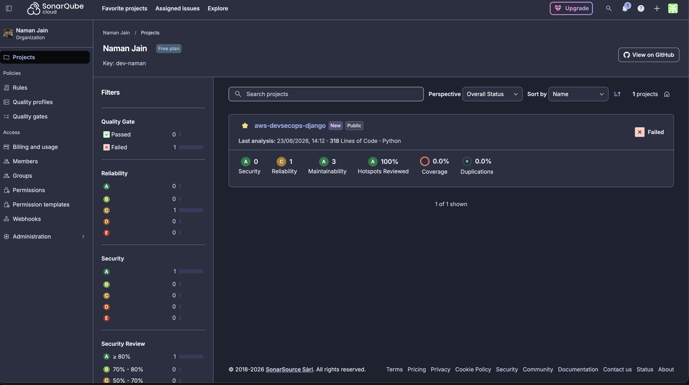
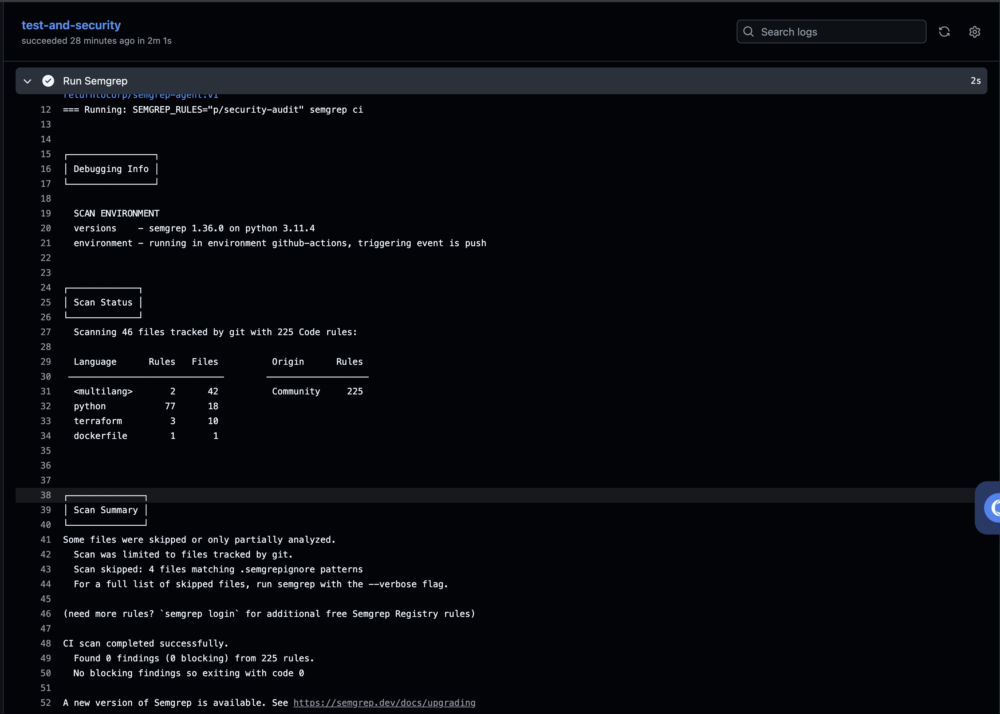
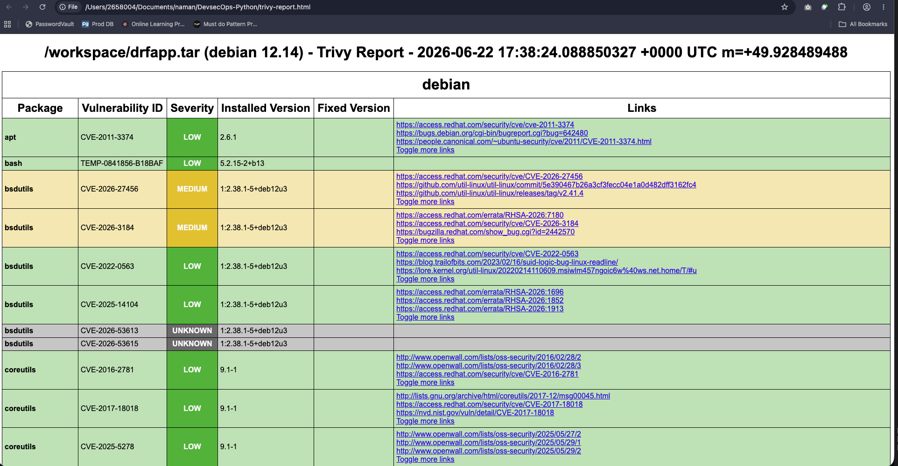
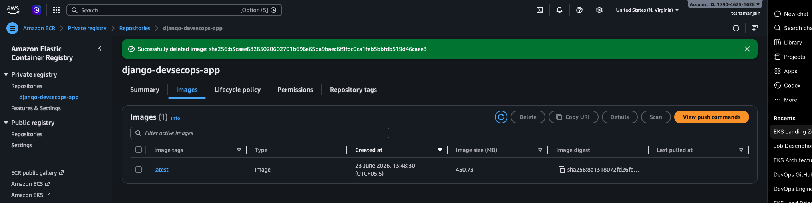
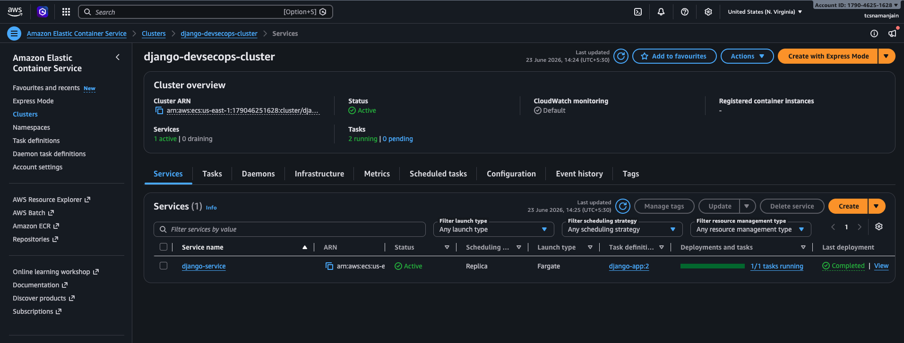
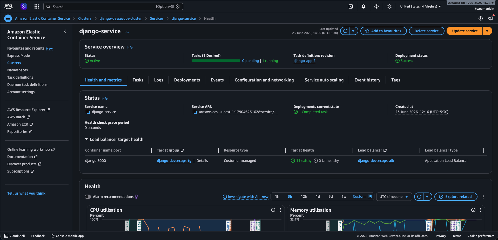
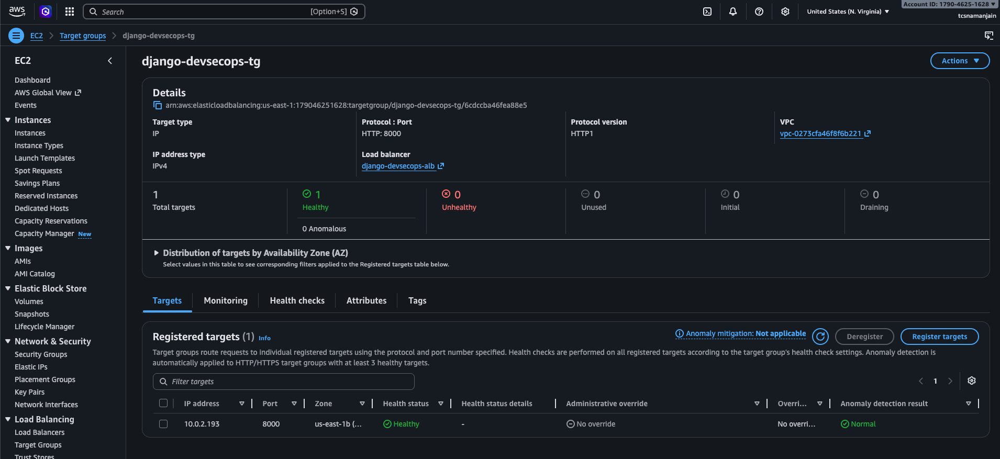
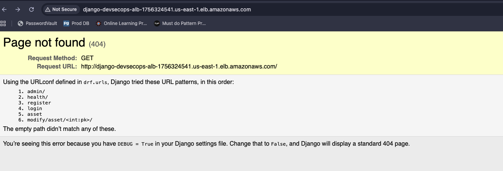

# 🚀 Production-Grade DevSecOps CI/CD Pipeline for Django on AWS ECS Fargate

[](../../actions)

## 📌 Project Overview

This project demonstrates a complete **DevSecOps CI/CD Pipeline** for a Django CRUD application deployed on **AWS ECS Fargate** using **Terraform Infrastructure as Code (IaC)**.

The pipeline automates:

- Code Testing
- Static Application Security Testing (SAST)
- Dependency Vulnerability Scanning
- Code Quality Analysis
- Container Vulnerability Scanning
- Docker Image Build
- Amazon ECR Push
- Automated ECS Deployment

The entire AWS infrastructure is provisioned using Terraform, enabling repeatable and consistent deployments.

---

# 🏗 Architecture



---

# 🔄 End-to-End Workflow

```text
Developer
    │
    ▼
GitHub Repository
    │
    ▼
GitHub Actions
    │
    ├── Pytest
    ├── Bandit
    ├── Pip-Audit
    ├── Semgrep
    ├── SonarCloud
    └── Trivy
    │
    ▼
Docker Build
    │
    ▼
Amazon ECR
    │
    ▼
Amazon ECS Fargate
    │
    ▼
Application Load Balancer
    │
    ▼
Django Application
```

---

# 🛠 Tech Stack

## Application

- Python 3.12
- Django
- Django REST Framework
- Gunicorn

## CI/CD

- GitHub Actions

## Security

- Bandit
- Pip-Audit
- Semgrep
- SonarCloud
- Trivy

## Containerization

- Docker
- Amazon ECR

## Infrastructure

- Terraform
- AWS VPC
- AWS IAM
- AWS ECS Fargate
- AWS Application Load Balancer
- AWS CloudWatch

---

# 📂 Project Structure

```text
aws-devsecops-django/
│
├── app/
├── drf/
├── tests/
│
├── terraform/
│   ├── provider.tf
│   ├── variables.tf
│   ├── networking.tf
│   ├── security_groups.tf
│   ├── ecr.tf
│   ├── ecs.tf
│   ├── alb.tf
│   ├── cloudwatch.tf
│   └── outputs.tf
│
├── .github/
│   └── workflows/
│       └── ci-cd.yml
│
├── docs/
│   ├── architecture/
│   └── screenshots/
│
├── Dockerfile
├── requirements.txt
└── README.md
```

---

# 🔐 Security Controls Implemented

## Bandit

Static analysis for Python code security vulnerabilities.

Checks:

- Hardcoded secrets
- Unsafe functions
- Insecure coding patterns

---

## Pip-Audit

Dependency vulnerability scanning.

Checks:

- Known CVEs
- Vulnerable package versions

---

## Semgrep

Advanced static application security testing.

Checks:

- OWASP Top 10
- Security misconfigurations
- Insecure coding practices

---

## SonarCloud

Code quality and security analysis.

Checks:

- Code smells
- Bugs
- Vulnerabilities
- Maintainability metrics

---

## Trivy

Container image vulnerability scanning.

Checks:

- OS package vulnerabilities
- Language-specific vulnerabilities
- Critical and High severity findings

---

# ⚙ CI/CD Pipeline Stages

## Stage 1: Testing

```bash
pytest
```

---

## Stage 2: SAST

```bash
bandit -r app drf
```

---

## Stage 3: Dependency Scan

```bash
pip-audit
```

---

## Stage 4: Security Analysis

```bash
semgrep
```

---

## Stage 5: Code Quality

```bash
sonar-scanner
```

---

## Stage 6: Container Scan

```bash
trivy image
```

---

## Stage 7: Build

```bash
docker build
```

---

## Stage 8: Push to ECR

```bash
docker push
```

---

## Stage 9: Deploy to ECS

```bash
aws ecs update-service
```

---

# ☁ Terraform Infrastructure

Terraform provisions:

### Networking

- VPC
- Public Subnets
- Route Tables
- Internet Gateway

### Security

- IAM Roles
- Security Groups

### Container Platform

- Amazon ECR Repository
- ECS Cluster
- ECS Task Definition
- ECS Service

### Load Balancing

- Application Load Balancer
- Target Groups
- Listeners

### Monitoring

- CloudWatch Log Groups

---

# 📸 Screenshots

## GitHub Actions Pipeline



---

## SonarCloud Dashboard



---

## Semgrep Scan



---

## Trivy Scan



---

## Amazon ECR



---

## ECS Cluster



---

## ECS Service



---

## ALB Target Group



---

## Application Running



---

# 🚀 Deployment

Clone repository:

```bash
git clone https://github.com/dev-naman/aws-devsecops-django.git
```

Move to project directory:

```bash
cd aws-devsecops-django
```

Initialize Terraform:

```bash
terraform init
```

Review infrastructure:

```bash
terraform plan
```

Deploy infrastructure:

```bash
terraform apply
```

Push code:

```bash
git push origin main
```

GitHub Actions will automatically:

- Run Tests
- Run Security Scans
- Build Docker Image
- Push to ECR
- Deploy to ECS

---

# 📈 Key Achievements

✅ Infrastructure as Code using Terraform

✅ Secure CI/CD using GitHub Actions

✅ OIDC Authentication between GitHub and AWS

✅ Automated Security Scanning

✅ Automated Container Scanning

✅ Containerized Django Application

✅ Amazon ECS Fargate Deployment

✅ Application Load Balancer Integration

✅ CloudWatch Logging

✅ Production-Oriented DevSecOps Workflow

---

# 🔮 Future Enhancements

- HTTPS using ACM Certificates
- Route53 Custom Domain
- Blue/Green Deployments
- ECS Auto Scaling
- CloudWatch Alarms
- Slack Notifications
- AWS WAF Integration
- Secrets Manager Integration
- Multi-Environment Support (Dev/QA/Prod)

---

# 👨‍💻 Author

**Naman Jain**

DevOps & Cloud Engineer

- AWS
- Terraform
- Kubernetes
- Docker
- GitHub Actions
- DevSecOps
- Cloud Infrastructure

GitHub: https://github.com/dev-naman

---

⭐ If you found this project useful, consider giving it a star.